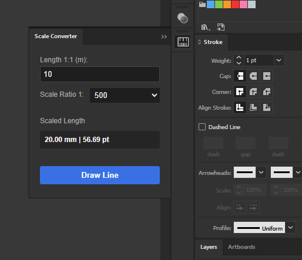
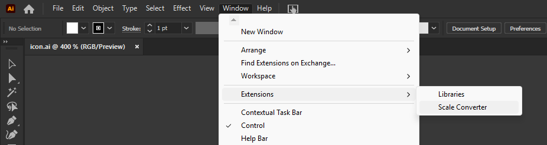
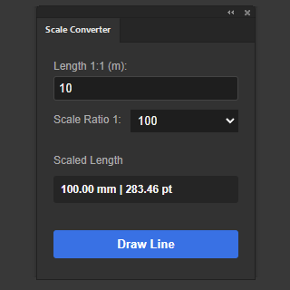
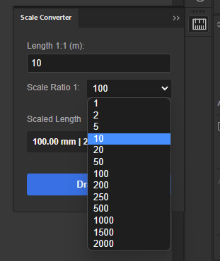

# Scale Converter Panel
## Overview

This extension is used to aid in architectural drawing within Adobe Illustrator by coverting length (m) at 1:1 scale into the drawing's scale (eg: 1:100, 1:250) in mm to ensure paths are to drawing to scale. The panel also contains a useful "Draw Line" button which will create a path at the scaled length for reference or use.

The default values are: 1:1 - 10m --> 1:100 = 100.00mm

## Installation
1. Download the .zip folder from the release section.
2. Go to the Adobe CEP extensions folder:
    - Mac: /Library/Application Support/Adobe/CEP/extensions
    - Win: C:\Program Files (x86)\Common Files\Adobe\CEP\extensions\
3. Create a folder named ArchitectScaleConverter.
4. Extract the contents of the zip file to the ArchitectScaleConverter folder.
5. Enable Adobe debug mode (required as this plugin isn't certified):
    - Mac (terminal): `defaults write com.adobe.CSXS.12 PlayerDebugMode 1`
    - Win (CMD): `reg add "HKCU\Software\Adobe\CSXS.12" /v PlayerDebugMode /t REG_SZ /d 1 /f`

## Usage
### Adding The Panel
- Launch Adobe Illustrator
- Navigate to the **Window** menu button
- Hover on the **Extensions** option
- Click **Scale Converter** to open the panel

### Interface

**Length 1:1 (m)** : Type the length in meters at the scale 1:1.

**Scale Ratio**  : Select from the drop down list a standard architectural drawing scale.

**Scaled Length** : The calculated length as a reference when drawing paths.

**Draw Line** : Click the button to draw a path on the canvas at the scaled length.

## Author
This extension has been designed and developed by Kelton Boyter-Grant.
